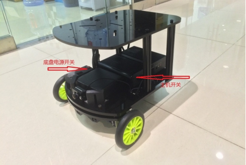

# <a id="start"></a>开始使用
本章介绍平台的快速使用方法，如果您对ROS系统和Ubuntu系统不熟悉，请先阅读第二章的[教程一](../topic/26.html)。

# <a id="network"></a>设置网络

首先将小强的主机连接上电脑显示器（小强pro用户请利用附赠的HDMI到VGA转接头进行连接, 小强mini用户请直接使用vga）。小强的默认密码是xiaoqiang，请及时更改默认密码。进入系统设置好小强的wifi网络连接。推荐设置路由器使小强使用静态ip,[静态IP设置方法](../topic/171.html)，方便以后连接。


# <a id="assemble"></a>产品组装

小强的主要部分如下图所示
<br>

<br>
将电池平放在主机前方空余区域（电池靠两个小黑块堵住），根据线标提示接上底盘电源线，安装好电脑主机wifi天线，摄像头和底层USB连接模块连接上主机的USB接口即可。


# <a id="status"></a>状态检查

组装完成之后就可以开始使用小强了。打开小强主机开关，等待主机蓝色灯亮起。小强左侧电源数据显示正常（电池电压合理使用范围是10V以上，当电池电压小于10V时小强会自动关机）。

通过ssh远程连接，其中xxx.xxx.xxx.xxx是小强的IP

```bash
ssh xiaoqiang@xxx.xxx.xxx.xxx
```

检查程序是否正常运行，执行以下指令
```bash
rostopic list
```

正常情况下会显示出当前的所有ROS topic.

```bash
/ORB_SLAM/Camera
/ORB_SLAM/Frame
/camera_node/image_raw
/orb_scale/scaleStatus
/rosout
/rosout_agg
/system_monitor/report
/tf
/usb_cam/brightness
/xqserial_server/Odom
/xqserial_server/Power
```

如果没有正常显示topic，可以尝试重启service。

```bash
sudo service startup restart
```

查看系统状态
```bash
rostopic echo /system_monitor/report
```

如果正常，则显示如下
```bash
imageStatus: True
odomStatus: True
orbStartStatus: False
orbInitStatus: False
orbScaleStatus: False
brightness: 0
power: 12.34432
```

其中imageStatus表示摄像头是否工作正常。odomStatus表示底层驱动时候工作正常。Orb相关的三个变量是视觉导航相关的状态，可以不用管（如果对这方面感兴趣可以在论坛里进行交流）。brightness是摄像头的亮度，power是当前电池的电压值，如果无法读取则是0.

# <a id="remote"></a>远程遥控

通过ssh进行连接

```bash
ssh xiaoqiang@xxx.xxx.xxx.xxx
```

启动遥控程序

```bash
rosrun nav_test control.py
```

现在就可以通过方向键来控制小强的移动了。空格键是停止。Ctrl + C 退出程序。


# <a id="video"></a>视频传输

小强的视频也是可以远程传输的。在本地打开一个终端输入

```bash
export ROS_MASTER_URI=http://xiaoqiang-desktop:11311
```

然后在本地系统的/etc/hosts文件内添加小强的ip

```
192.168.X.X  xiaoqiang-desktop
```

输入下述命令开始显示摄像头视频

```bash
rosrun image_view image_view image:=/camera_node/image_raw  _image_transport:=compressed
```

如果一切正常就能够看到当前小强的摄像头画面了。


# <a id="intro"></a>软件整体结构和说明

小强的软件构建于ROS之上。程序主要包含有底层驱动，导航算法，slam算法。
对于机器人来说，软件是一个整体，各部分的依赖程度都比较高。为了方便管理，系统中的基础功能用一个service统一操作。也就是前文中提到的startup service。这个service会启动底层的驱动软件包和摄像头。
startup软件包位于/home/xiaoqiang/Documents/ros/src/startup。系统启动时会自动启动这个服务。如果想要更改这个服务的内容，可以修改这个软件包内的launch文件。具体的操作请[参照这里](../topic/27.html)。
系统的导航程序采用的是ROS自带的导航程序包。不过导航参数是根据小强自己的参数修改过的。导航参数对导航的性能表现影响很大，你也可以尝试自己修改参数以提高表现。
slam算法采用的是ORB_SLAM，这个算法目前还无法用于实际的生产环境，但是使用效果也很不错。
最后就是一些工具类软件了。比如控制小车移动的 nav_test control.py，显示系统状态的system monitor。


# <a id="rosintro"></a>ROS入门手册

[Learning ROS for Robotics Programming - Second Edition.pdf](http://pan.baidu.com/s/1ge6ffZt)。这本教程很基础、很全面，虽然以Hydro版本为例，但是也完全兼容jade版本，代码实例中只需将书中的Hydro字符串替换成jade即可。请重点阅读本书的第二章和第三章。
